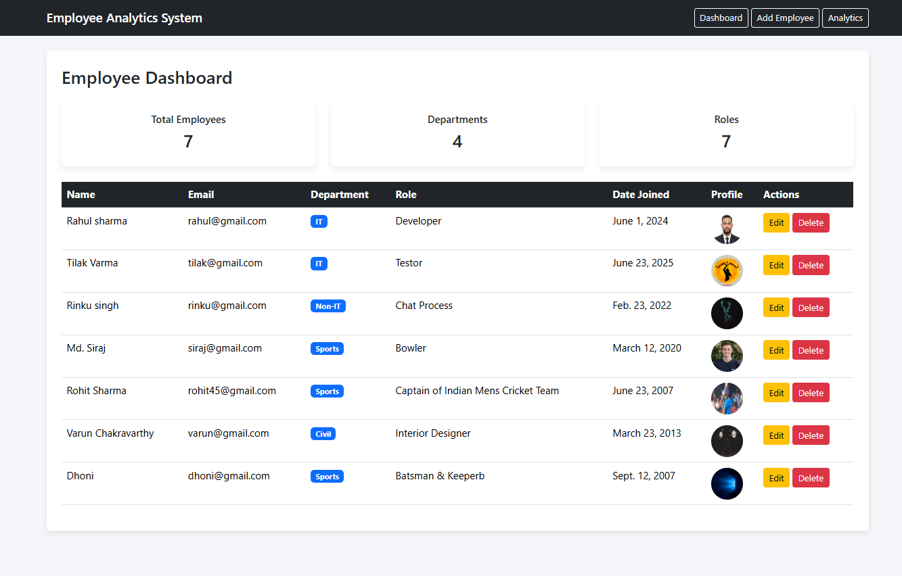
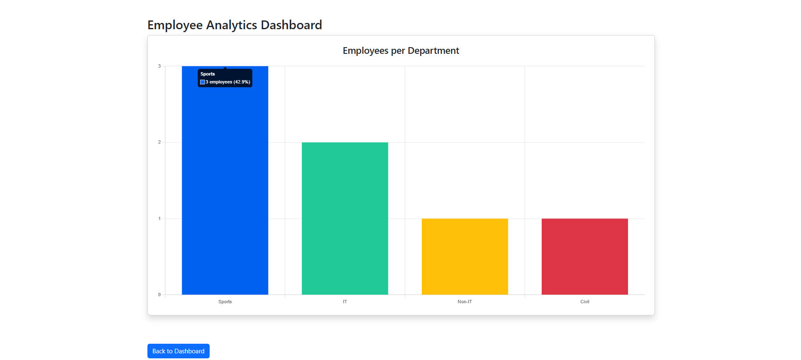

# 🚀 Employee Analytics & Management System

A **full-stack Django web application** to manage employees and visualize workforce analytics through an interactive dashboard.

This project demonstrates **backend development, data analysis, cloud image storage, and interactive visualizations**.

---

## 📌 Features

✔ Employee **CRUD Operations** (Create, Read, Update, Delete)
✔ **Profile Image Upload** using Cloudinary
✔ **Analytics Dashboard** with interactive charts
✔ **Department-wise Employee Insights**
✔ **Responsive UI** using Bootstrap
✔ **Data Processing with Pandas**
✔ **Interactive charts using Chart.js**

### 📋 Employee Management Dashboard


## Dashboard Preview


## 🛠 Tech Stack

### Backend

* Python
* Django

### Frontend

* HTML
* Bootstrap
* Chart.js

### Data Processing

* Pandas
* Matplotlib

### Cloud Storage

* Cloudinary

### Database

* SQLite

### Version Control

* Git
* GitHub

---

## 📂 Project Structure

```
employee-analytics-system
│
├── config
│   ├── config
│   ├── employees
│   │   ├── templates
│   │   ├── models.py
│   │   ├── views.py
│   │   └── urls.py
│   └── manage.py
│
├── assets
├── requirements.txt
├── README.md
└── .gitignore
```

---

## ⚙ Installation

### 1️⃣ Clone the Repository

```
git clone https://github.com/YOUR_USERNAME/employee-analytics-system.git
```

### 2️⃣ Navigate to the Project

```
cd employee-analytics-system
```

### 3️⃣ Create Virtual Environment

```
python -m venv venv
```

### 4️⃣ Activate Environment

Windows

```
venv\Scripts\activate
```

Mac/Linux

```
source venv/bin/activate
```

### 5️⃣ Install Dependencies

```
pip install -r requirements.txt
```

### 6️⃣ Run Migrations

```
python manage.py migrate
```

### 7️⃣ Start the Server

```
python manage.py runserver
```

Open in browser:

```
http://127.0.0.1:8000
```

---

## 📊 Analytics

The analytics dashboard provides:

* Employee distribution by department
* Visual insights through interactive charts
* Percentage insights on hover

---

## ☁ Cloudinary Integration

Cloudinary is used to:

* Store employee profile images
* Handle secure image hosting
* Improve media scalability

---

## 🔮 Future Improvements

* Authentication & role-based access
* More advanced analytics charts
* Search & filter functionality
* Export reports
* Docker deployment
* Production database (PostgreSQL)

---

## 👨‍💻 Author

**Sumithreddy**

B.Tech CSE (Data Science)

---
